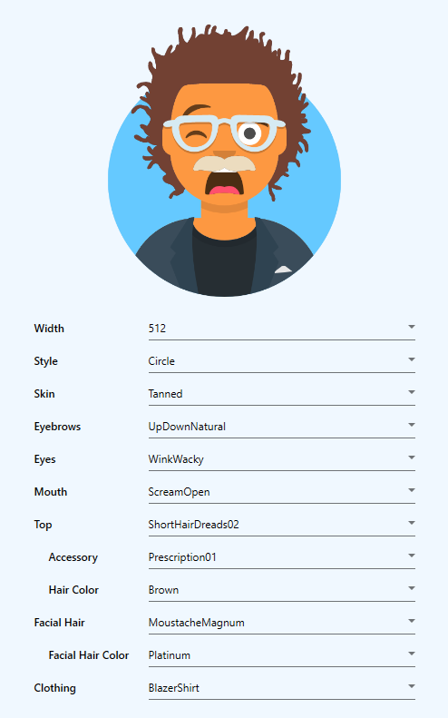

# AvataaarsNet - The .NET Component for Avataaars


This is a WPF Component porting of [Avataaars Generator](https://github.com/fangpenlin/avataaars-generator) by [Fang-Pen Lin](https://twitter.com/fangpenlin).

## Features

- Built on top of .NET Framework 4.7.2
- Uses the https://avataaars.io endpoint for generate the images (can also be self-hosted, see [below](#self-hosted-server-side-rendering))

## Usage



Add the reference to the namespace AvataaarsNet in your project and in your XAML.

```xaml
xmlns:avataaarsnet="clr-namespace:AvataaarsNet;assembly=AvataaarsNet"
```

Add the component in your XAML (typical implementation, may vary based on purposes)

```xaml
<avataaarsnet:AvataaarsGenerator
  x:Name="Avataaaars"
  Avatar="{Binding Path=Avatar, ElementName=MyWindow, Mode=OneWayToSource, UpdateSourceTrigger=PropertyChanged}"
  Configuration="{Binding Path=Configuration, ElementName=MyWindow, Mode=TwoWay, UpdateSourceTrigger=PropertyChanged}"
  EnableWidth="{Binding Path=EnableWidth, ElementName=MyWindow, Mode=OneWay, UpdateSourceTrigger=PropertyChanged}" />
```

It exposes three DependencyProperty:

***`Avatar`*** is the resulting `Bitmap` (*OneWayToSource*) image based upon the actual configuration.

***`Configuration`*** is the binding (*TwoWay*) of an `AvataaarsConfiguration` object that contains all the parameters to generate the image (can be used to save the configuration and restore it later).

***`EnableWidth`*** is the binding (*OneWay*) to show or hide the custom Width parameter (default value is 512px).

## Randomize

This library provides a usefull `Randomize` function to generate a `Configuration` object to bind to the control.  
Just use

```csharp
AvataaarsSettings.Randomize(uint width)
```

and bind the return to the configuration property.

## Demo

A working demo can be found on my other repository [here](https://github.com/informagico/avataaarsnet-demo).  
There is no nuget package so you need to add this project to the solution or compile the *.dll* and add it as a reference.

## Self-hosted server side rendering

Special thanks to [@gkoberger](https://github.com/gkoberger) for porting the React component server side and deploying it to https://avataaars.io  
This can also be self-hosted, refer to its [repository](https://github.com/gkoberger/avataaars) for further details.

Another simple way to host it by yourself, **with Avataaars React package updated to v1.2.1**, minor improvements and no AWS storage, is to follow my fork [here](https://github.com/informagico/avataaars).

**NB:** When self hosted you simply need to change the **baseUrl** value in the **Avataaars** class to call the correct endpoint.
